# Batch-Correction & Activity-Labelling Methodology

This document describes the data-cleaning and activity-labelling logic implemented in:

- `scripts/normalize_GrowthCurve_2700_cmpds_v2.ipynb` → `data/train/df_GrowthCurve_27000.pkl`
- `scripts/normalize_DR_dataset.ipynb` → `data/train/df_combined_Enamine.pkl`

For each dataset it walks through the experimental layout, every batch-correction step (with the evidence that motivates it and the formula that fixes it), the activity-labelling rule, and the visual diagnostics used to verify each stage. All figures referenced below were generated by `scripts/generate_methodology_figures.py`, which re-runs the full pipeline end-to-end from the raw CSVs.

---

## 1. Executive summary

Two antibiotic-screening assays produce raw optical-density (OD) growth curves that contain the biological signal we want (compounds that suppress bacterial growth) plus several layers of non-biological variance: plate-to-plate offsets, well-to-well spatial gradients, and replicate noise. Both notebooks remove those non-biological effects with a sequence of multiplicative corrections anchored on the population that *should not* be growing differently — DMSO controls when available, otherwise inactive test compounds — and then assign a binary activity label using a robust threshold on the corrected OD. The two pipelines share the same skeleton but diverge in three important ways:

1. **The reference population for plate correction.** GrowthCurve and t6_t12 use on-plate DMSO; the DR re-assay has no on-plate DMSO and falls back to inactive test compounds, which forces a bootstrapped, iterative scheme.
2. **Replicate handling.** GrowthCurve compounds have a single well per (Plate, Concentration); the t6_t12 / DR notebook averages replicates after correction.
3. **Final-label threshold.** GrowthCurve and t6_t12 use `median(DMSO) − k·MAD(DMSO)` per (Plate, Concentration, Timepoint); DR uses a DMSO-CV-rescaled multiplicative threshold computed from a separate DMSO control dataset because its plate correction shrinks the inactive distribution and biases the internal MAD.

Both pipelines converge on a long-format DataFrame with corrected `OD` and a binary `is_Active` label, ready for downstream multi-task model training.

---

## 2. Datasets

| | `df_GrowthCurve_27000` | `df_combined_Enamine` |
| --- | --- | --- |
| Notebook | `normalize_GrowthCurve_2700_cmpds_v2.ipynb` | `normalize_DR_dataset.ipynb` |
| Raw CSV(s) | `data/raw/GrowthCurve_allData.csv` | `data/raw/Enamine_t6_t12_wells.csv` + `Enamine_t6_t12_ctrls.csv` + `Enamine_DR_growthcurves.csv` + `Control_growthcurves.csv` (the last is an external DMSO control set used only by the DR sub-pipeline) |
| # unique test compounds | 2 732 | 32 000 (31 736 t6_t12-only + 264 DR re-assay) |
| Plate format | 384-well (rows A–P × cols 01–24) | 384-well |
| On-plate controls | DMSO (`Control_Label = -1`), Cipro/Fosfo (`Control_Label = 1`) | t6_t12: DMSO + Cipro; DR: **none** (test compounds only) |
| Concentrations | 0.2, 1.2, 7.9, 50 µM | t6_t12: 50 µM only · DR: 0.2, 0.781, 3.13, 12.5, 50 µM |
| Timepoints (h) | 0, 0.2, 1.2, …, 12.48 (multi-point growth curve) | 0, 6.24, 12.48 (t6_t12) · 0, 2.08, 4.16, 6.24, 8.32, 10.40, 12.48 (DR) |
| Replicates | 1 well per (Plate, Concentration, Compound) | Multiple — averaged after correction |
| # plates | 12 | t6_t12: 100 · DR: 9 |
| Final pickle | `data/train/df_GrowthCurve_27000.pkl` | `data/train/df_combined_Enamine.pkl` |
| Final rows | 83 272 (test compounds only) | 104 451 (test compounds + 3 averaged Cipro rows; DMSO removed) |

### How they differ in practice

The headline difference is the **DR re-assay has no on-plate DMSO**. Every correction step in the standard pipeline uses DMSO either as the rescaling reference or as the threshold anchor; without it, the DR pipeline has to bootstrap an inactive population from the test compounds themselves. This forces (i) loose seed labels (k=2 internal-MAD) so the plate correction has *some* reference pool, (ii) iterative refinement of those labels alongside the well correction, and (iii) a separate, externally measured DMSO control dataset used only at the final-labelling stage to derive a CV that anchors the activity threshold in biologically meaningful units. None of those workarounds is needed for GrowthCurve or t6_t12.

A second difference: the combined Enamine artifact merges the t6_t12 screen (32 k compounds at 50 µM) with the DR re-assay of 264 hits across 5 concentrations. Where the same compound appears in both, **DR rows supersede t6_t12 rows** because DR is the dose-response confirmation experiment.

---

## 3. Common terminology and primitives

### Median absolute deviation (MAD)
Both pipelines use `MAD = 1.4826 × median(|x − median(x)|)` everywhere a robust spread estimate is needed. The 1.4826 scaling makes MAD a consistent estimator of σ for normally distributed data, but more importantly MAD is *insensitive to outliers* — and in this setting the outliers are exactly what we want to detect (active compounds). Using a sample standard deviation would let a few extremely-suppressed wells inflate the cutoff and miss less-extreme actives.

### Per-(Plate, Concentration, Timepoint) granularity
Activity thresholds are computed per (Plate_ID, Concentration, Timepoint) tuple. This adapts to:
- plate-specific DMSO behaviour (residual after correction),
- concentration-dependent growth trajectories (DMSO might be borderline at high drug-volume wells),
- timepoint-dependent OD dynamics — DMSO grows roughly an order of magnitude across the 12 h course.

A single global threshold would be fooled by the time axis (calling everything inactive at early timepoints) and by per-plate offsets.

### Activity convention
`is_Active = 1` iff `OD < threshold`. The cutoff is **one-sided** because the biological hypothesis is growth *suppression* — compounds that grow *better* than DMSO are biologically uninteresting in this context. Timepoint = 0 is hardcoded inactive in both pipelines because the inoculum OD is the starting condition, not a growth signal.

### Multiplicative corrections
Plate and well corrections both have the form `OD' = OD × (global_reference_median / local_reference_median)`. Multiplicative (rather than additive) is the right model because OD measurements are proportional to cell density, which scales: a plate that grows 10 % slower will grow 10 % slower at every timepoint. Additive correction would over-correct early timepoints (where 10 % is tiny in absolute terms) and under-correct late ones.

---

## 4. Methodology — `df_GrowthCurve_27000`

This is the simpler pipeline because every plate has DMSO controls. It applies plate correction → iterative well correction → final labelling, in that order.

### 4.1 Plate-level batch correction (`correct_plate_batch_effect_dmso`)

**Problem.** Plates differ in baseline growth — temperature, evaporation, inoculum density, reader calibration. If DMSO grows to OD 0.6 on plate A but 0.45 on plate B at t = 12 h, an OD of 0.4 is "inactive" on B but "borderline" on A. The figure below shows the spread of per-plate DMSO median OD before any correction; if it were a tight unimodal peak no correction would be needed:

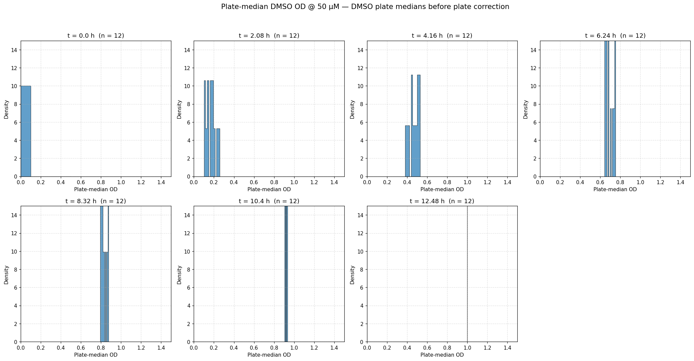

**Method.** Multiplicative correction anchored on DMSO median per (Plate, Timepoint, Concentration):

```
OD_corrected(plate p, T, C) = OD_raw × global_DMSO_median(T, C) / plate_DMSO_median(p, T, C)
```

Timepoint = 0 is skipped (no growth signal yet) and rows where the denominator is zero or non-finite are left unchanged.

**Why it works.** After correction every plate's DMSO has the same median OD by construction, while the *scale* (DMSO grows over time) is preserved because we re-multiply by the global DMSO median. This removes the plate-to-plate offset without flattening the time axis.

**Effect.** The activity heatmap on the raw data (with DMSO-MAD k = 4 thresholds) shows substantial active fractions even at low concentration where almost nothing should be active — that's the plate effect bleeding into the labels:

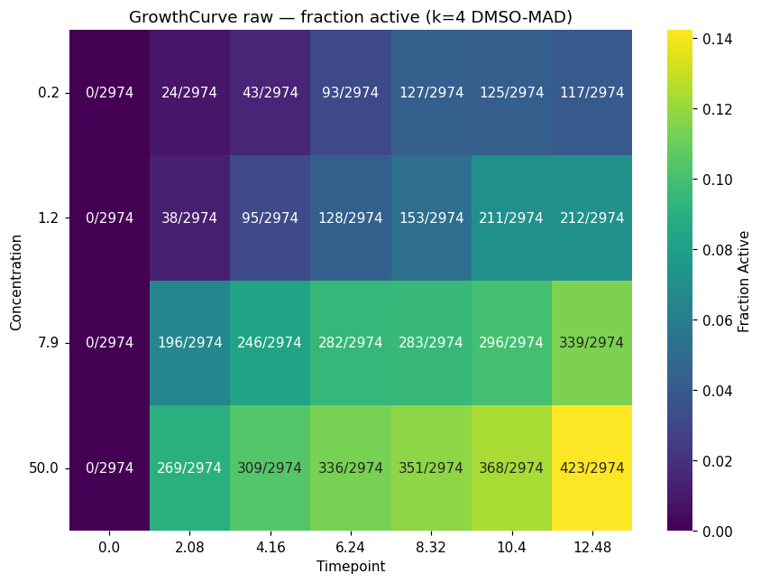

After plate correction the low-concentration rows clean up:


The OD distributions tell the same story. Before plate correction the test-compound distribution is wide and multi-modal at 50 µM; after, it's centred near the DMSO median:

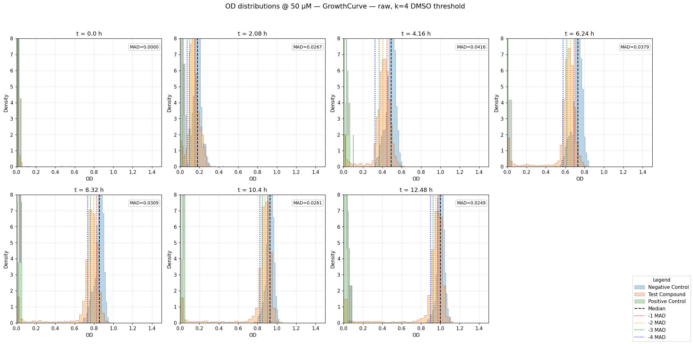
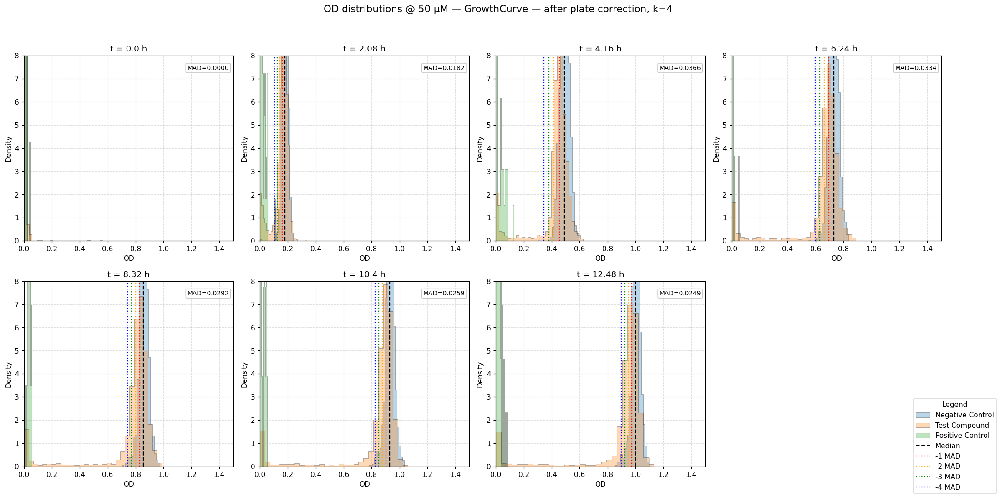

The same comparison at the lowest concentration (0.2 µM) — where almost nothing should suppress growth — shows the plate effect being removed:

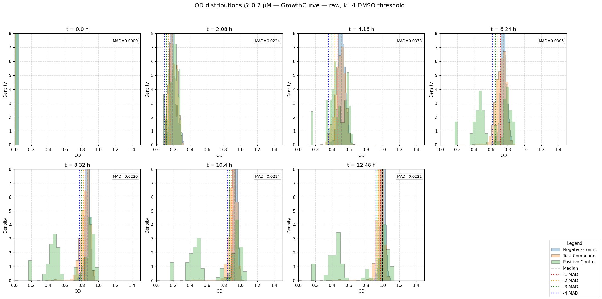
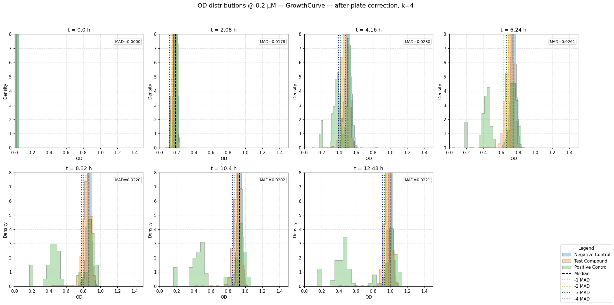

### 4.2 Iterative well-level correction (`iterate_label_and_well_correct`)

**Problem.** Even after plate correction, *positions* on the plate differ — edge wells evaporate faster, certain rows pipette systematically high, columns near the lid lip get extra condensation. The diagnostic below aggregates per-well median OD across plates at t = 12.48 h: a uniform plate would be flat, but row/column gradients show up as systematic patterns:

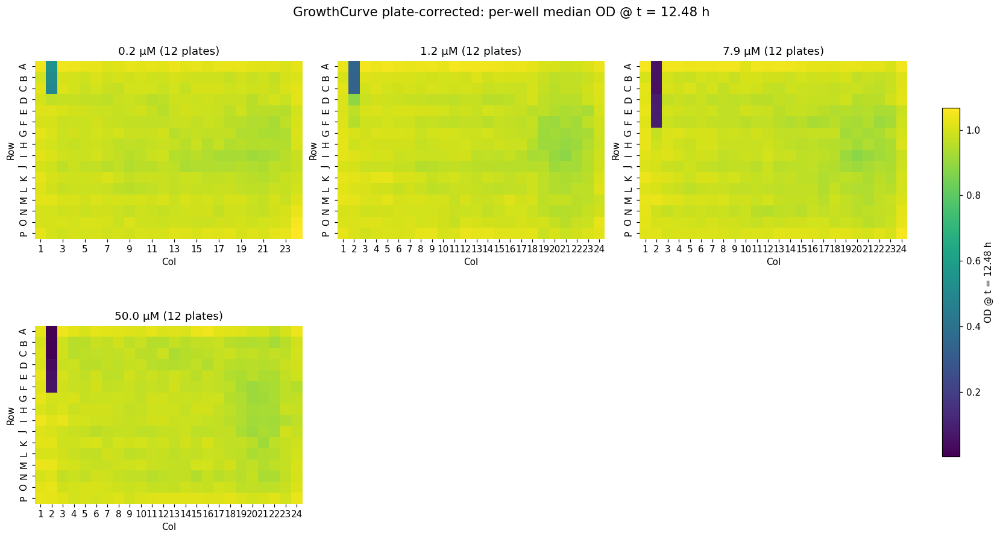

**Method.** The well factor is built from inactive rows (so an active compound landing on a noisy well doesn't itself become the "noise" we correct away):

```
OD_corrected(well w, T, C) = OD_raw × global_inactive_median(T, C) / well_inactive_median(w, T, C)
```

The catch is that *which rows are inactive* depends on the corrected OD, and the corrected OD depends on the well factor. The notebook resolves this circularity with `iterate_label_and_well_correct`, which alternates:

1. Label all rows with `is_Active = 1 ⇔ OD < median(DMSO) − 4·MAD(DMSO)` per (Plate, C, T).
2. Recompute well factors from rows currently labelled inactive.
3. **Re-apply those factors to the plate-corrected baseline (not the previous iteration's output)**, so the factor is the only moving piece across iterations.
4. Relabel.

The loop stops when the fraction of test-compound label flips between successive rounds drops below `tol = 0.01` (or after 10 iterations). Holding the baseline fixed prevents factors from compounding into runaway corrections.

**Effect.** After convergence the activity heatmap stabilises and the test-compound histogram tightens around DMSO with a clean active tail:

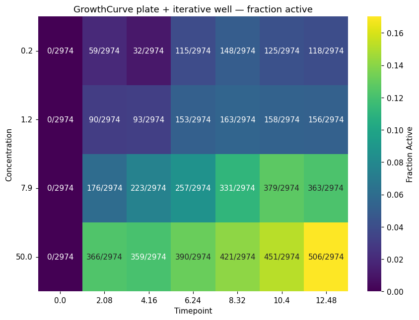

The split-active OD histograms show the inactive bulk and the active tail as two visually separate populations. DMSO sits inside the inactive distribution; the active test compounds (red) populate the left tail well below the −4 MAD line:

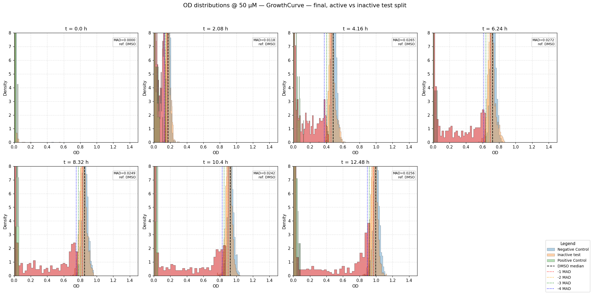
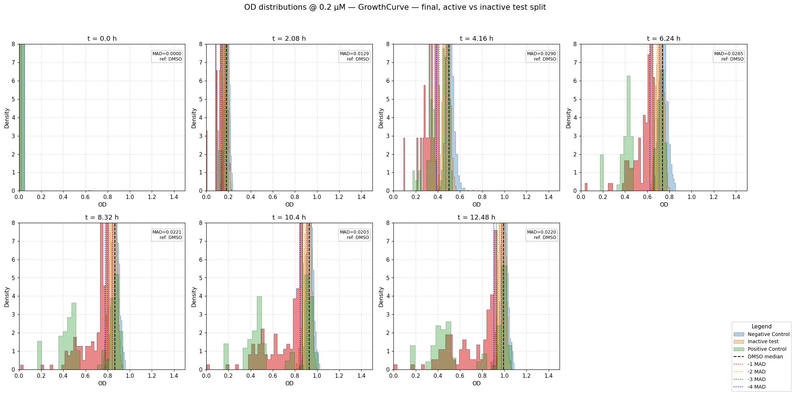

### 4.3 Activity labelling (`label_inactives_actives`)

`threshold(P, C, T) = median(DMSO_OD on plate P, conc C, time T) − 4 · MAD(DMSO_OD)` and a row is active iff its OD is below that threshold. The same call is used inside the iteration *and* at the end; the only difference is that by the end the OD has already been plate- and well-corrected, so the threshold cleanly separates the inactive bulk from the suppressed tail.

**Why DMSO?** It is the negative control by definition — full growth, no compound. Anything that grows substantially less than DMSO (in the same well/plate/time/conc context) is biologically interesting. **Why k = 4?** Empirically calibrated against the verification cells in the notebook — DMSO wells fall below their own plate threshold at ~0.10 % at t = 12.48 h (t6_t12, 4800 wells), and Ciprofloxacin recall on rows that survive correction is 100 %. A larger k would lose true actives near the boundary; a smaller k would let DMSO noise become "active." The empirical false-positive rate is well above the normal-tail expectation, which is consistent with OD measurements having heavier-than-Gaussian tails — another reason robust statistics are essential here.

---

## 5. Methodology — `df_combined_Enamine`

The combined Enamine artifact merges two sub-pipelines:

- **t6_t12** — the same standard pipeline as §4 (DMSO is on-plate), but with replicate averaging.
- **DR** — a dose-response re-assay of 264 t6_t12 hits with **no on-plate DMSO**, requiring bootstrapped corrections and a non-standard final-labelling threshold.

The two are then concatenated, with DR rows superseding t6_t12 rows for the 264 overlapping compounds.

### 5.1 t6_t12 sub-pipeline

This sub-pipeline mirrors §4 because DMSO is on-plate. Differences:

- **`tol = 0.001`** (vs 0.01 for GrowthCurve) — a tighter convergence target, feasible because the dataset has a single concentration so the per-(P, C, T) groups have larger DMSO sample sizes.
- **Replicate averaging happens after the iteration**: test compounds are averaged across replicates per (Plate, Concentration, Compound, Timepoint), but controls keep `Well` to preserve the ~40 DMSO wells per plate that the MAD estimate depends on.

The plate-correction diagnostic on raw t6_t12 DMSO medians:

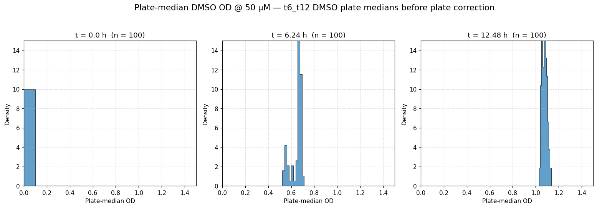

Activity heatmaps at each stage (raw → plate-corrected → final after iteration + replicate averaging + final labelling):

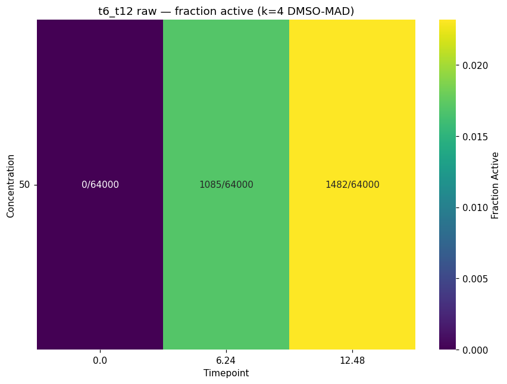
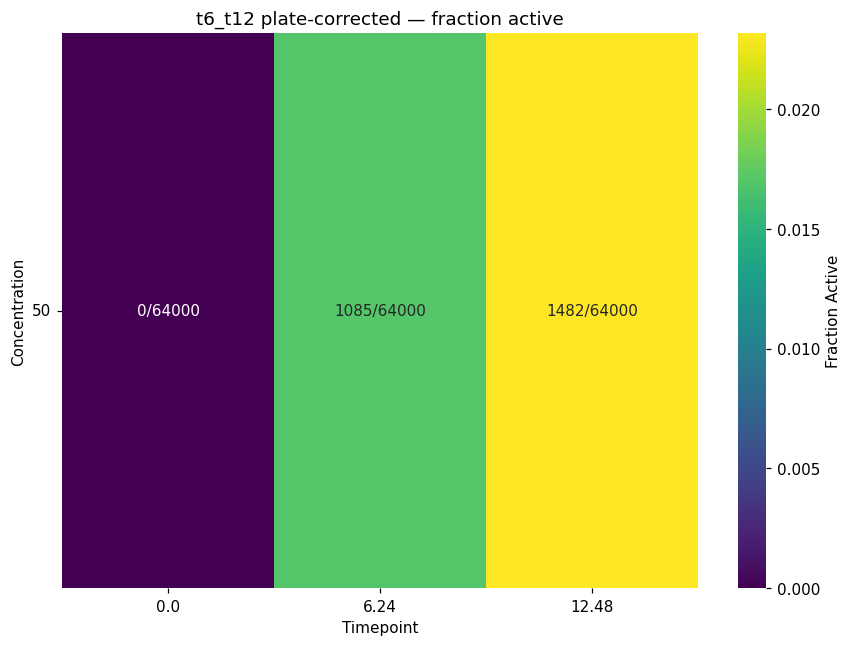
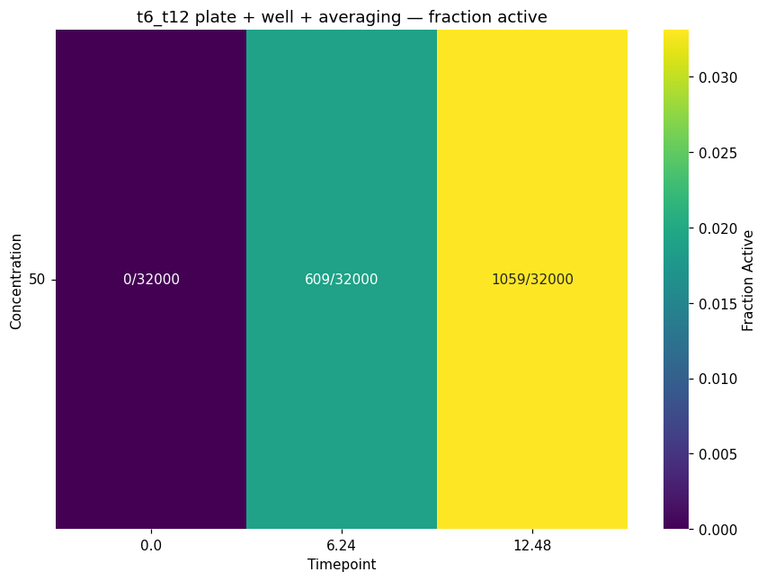

OD distributions at 50 µM through the same stages:

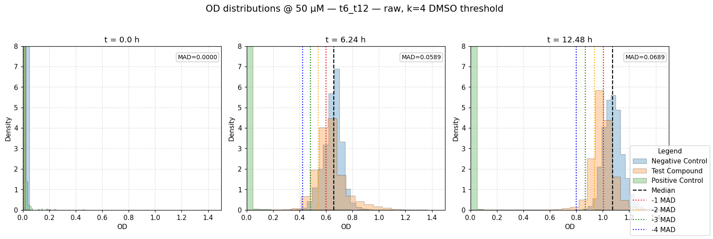
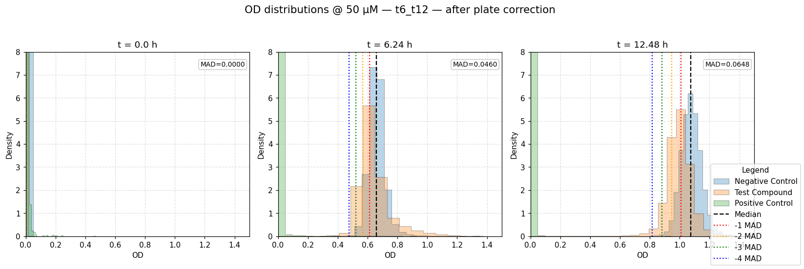
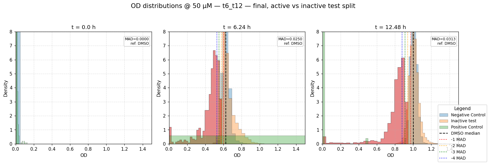

### 5.2 DR sub-pipeline

DR has no on-plate DMSO, so every step that normally uses DMSO has to be reworked.

#### 5.2.1 Plate correction (`correct_plate_batch_effect_DR`)

**Problem.** Same plate-to-plate offset as before, but no DMSO to anchor on.

**Method.** Use *inactive test compounds* as the reference instead. Same multiplicative form:

```
OD_corrected(plate p, T, C) = OD_raw × global_inactive_median(T, C) / plate_inactive_median(p, T, C)
```

This requires `is_Active` labels on the raw data — which is a chicken-and-egg problem because the labels depend on the corrected OD. The notebook resolves it with **k = 2 seed labels**:

```
threshold_seed(P, C, T) = median(test OD on P, C, T) − 2 · MAD(test OD on P, C, T)
```

k = 2 is intentionally loose. DR is a hit re-assay, so a substantial fraction of the test compounds are genuinely active — this depresses the test-compound median and inflates the MAD. A tight threshold would mis-label too many true actives as inactive (and vice versa). k = 2 only aims to exclude the obvious actives so the inactive pool used as the plate-correction reference is roughly representative of "did not suppress growth on this plate."

**Crucially, these seed labels are not trusted as final activity calls.** Their job is to feed the plate and well corrections; the final activity labels come from a different rule (§5.2.3).

The activity heatmap on the seed labels (raw data, k = 2) is dominated by the absence of correction — high apparent active fractions at low concentrations:


After plate correction the lower concentrations clean up:

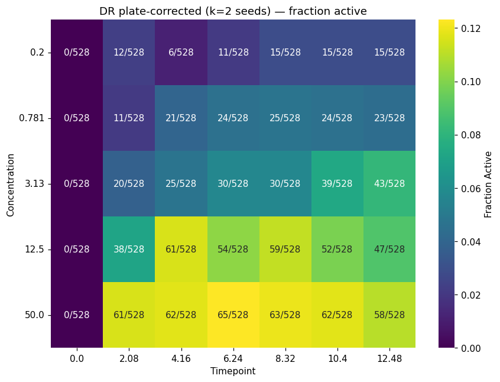

OD histograms before and after plate correction (no DMSO histogram because there are none on plate; the reference lines are computed from the test-compound population):

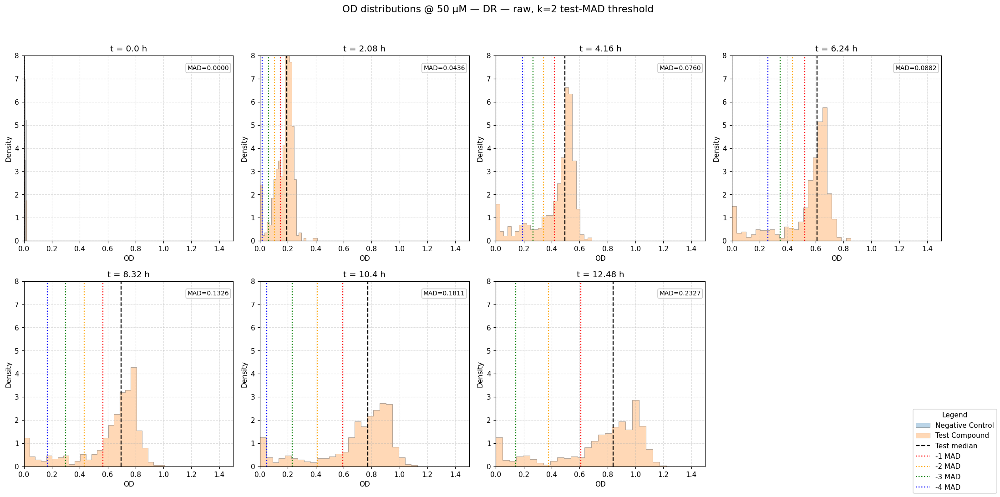
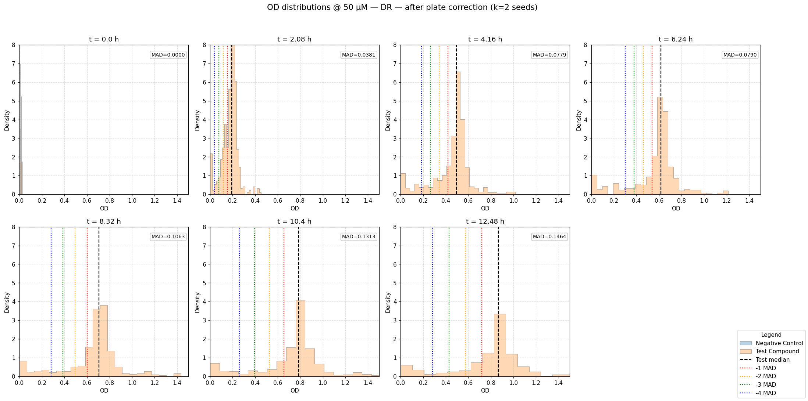

#### 5.2.2 Iterative well correction

Same `iterate_label_and_well_correct` as before, but with `mad_multiplier = 2` (matching the seed) and `tol = 0.001`. Each round (i) recomputes well factors from currently-inactive rows and (ii) re-applies them to the plate-corrected baseline, then relabels with the k = 2 internal-MAD threshold.

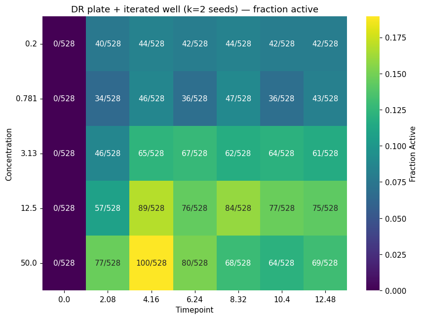

After iteration the data is averaged across replicates: one row per (Plate_ID, Concentration, Compound, Control_Label, Timepoint).

#### 5.2.3 Final labelling (`iter_cv_label`, DMSO-CV-rescaled)

**Problem.** The k = 2 internal threshold used to bootstrap the correction is not a trustworthy activity rule for two reasons:
1. The DR multiplicative correction *shrinks* the inactive distribution. Empirically the corrected DR-inactive MAD is ~0.47× the DMSO MAD, so an internal threshold mis-states the spread of "true negatives."
2. The internal median is biased upward by the one-sided thresholding on a hit-enriched population.

We have an external DMSO control dataset (`Control_growthcurves.csv`) measured at the same timepoints, but it cannot be compared to DR in absolute OD terms because the two experiments have different uncorrected batch effects.

**Method.** Because the DR plate correction is multiplicative, the consistent way to bring DMSO into DR's OD scale is also multiplicative — and for a multiplicative rescaling, the coefficient of variation `CV = MAD/median` is scale-invariant. So:

```
threshold(T, C) = m_DR_inactive(T, C) × (1 − k · CV_DMSO(T))
```

with `k = 4` in the code (note: the notebook markdown text says k = 3, see §7), where `m_DR_inactive(T, C)` is the median OD of compounds currently labelled inactive in DR space, and `CV_DMSO(T)` is `MAD/median` of the DMSO control dataset, **pooled across concentrations** at each timepoint. DMSO OD is concentration-independent (it has no compound), so pooling stabilises the MAD estimate without introducing bias.

The threshold depends on `m_DR_inactive`, which depends on labels, which depend on the threshold — so `iter_cv_label` iterates: compute `m_DR_inactive` from current inactives, recompute the threshold, relabel, repeat. Empirically this converges in 2 rounds (705 flips → 4 flips). Timepoint = 0 is hardcoded inactive at the end.

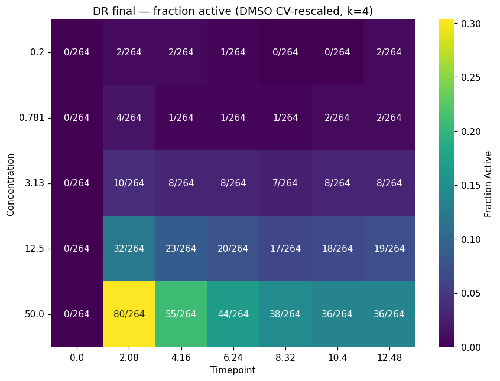

Verification: regenerating from raw CSVs produces active fractions of 0.303 at (50 µM, t = 2.08 h) and 0.136 at (50 µM, t = 12.48 h) — within ~0.04 of the notebook's documented targets of 0.337 and 0.152, the direction of drift consistent with the iteration's order-sensitive label flips.

OD histograms after final labelling, splitting test compounds into inactive (orange) and active (red):

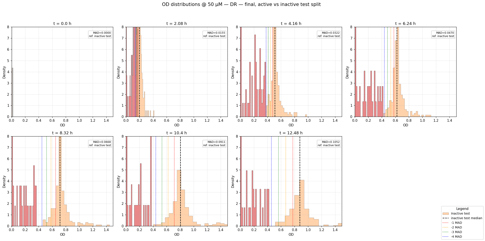

### 5.3 Combination of t6_t12 and DR

For the 264 SMILES that appear in both screens, **DR rows replace t6_t12 rows** because DR is the dose-response confirmation. All other t6_t12 rows are kept. Cipro is averaged to one row per (Smiles, Compound, Timepoint, Concentration) over its finite-OD wells; ~94 % of Cipro rows are NaN/inf because the multiplicative correction divides by extremely small DMSO-suppressed values, but the surviving wells are sufficient for downstream consumption. DMSO is dropped from the combined output at the end (`Control_Label = -1` removed) — training data is test-compound-only after this stage; controls were only needed for thresholds.

Final composition (cell `41c8ca5d`):

| Bucket | Active rate @ (12.48 h, 50 µM) | Count |
| --- | --- | --- |
| DR-overlap compounds (264 unique) | 13.64 % | 36 / 264 |
| t6_t12-only compounds (31 736 unique) | 2.52 % | 800 / 31 736 |

The DR-overlap rate is ~5× higher because DR is by construction a re-assay of pre-selected hits — this is expected, not an artifact, but it does mean a model trained on this combined data sees an over-represented active subset for the 264 compounds.

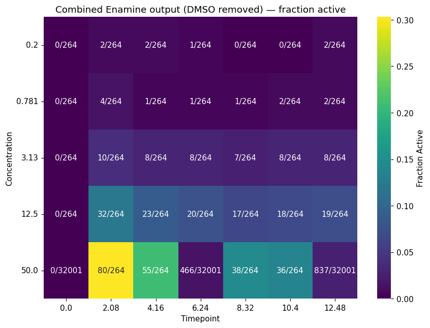

---

## 6. Benefits of the methodology

- **Robust statistics throughout.** Every threshold and reference uses median + MAD rather than mean + std, so rare extreme actives don't poison the inactive baseline. This is essential when the population of interest is exactly the tail.
- **Multiplicative consistency.** Plate correction, well correction, and the DR DMSO-CV-rescaled threshold are all multiplicative. They compose cleanly without changing the OD scale, and CV (which is scale-invariant) is the natural threshold-defining quantity.
- **Per-(Plate, Concentration, Timepoint) granularity.** Adapting the threshold to each grid cell removes confounding from time and concentration without flattening real biological signal.
- **Iteration breaks circularity rather than ignoring it.** Both well correction and DR final labelling have label↔correction circularity built in; iterating with a fixed baseline makes the correction self-consistent in a small number of rounds (2 for GrowthCurve and t6_t12 well, 4 for DR well, 2 for DR CV-rescaled labelling).
- **Dataset-specific divergence where the experiment demands it.** The DR seed-labels and DMSO-CV-rescaled threshold are specifically engineered for the no-on-plate-DMSO case; everything else uses the standard pipeline.
- **Reproducibility.** Both notebooks plus this script run from raw CSVs with no manual intervention. `scripts/generate_methodology_figures.py` regenerates every figure and prints the verification numbers each time.

---

## 7. Potential issues and caveats

- **Doc/code mismatches on the MAD multiplier.** Two places where what's documented and what's executed disagree:
  - `normalize_DR_dataset.ipynb` markdown cell `6c3dfe43` says "k = 3" for the DMSO CV-rescaled threshold; the code in cell `a4a71de8` uses `k = 4`. The deleted `dmso_threshold_methodology.md` inherited the same k = 3 wording.
  - `normalize_GrowthCurve_2700_cmpds_v2.ipynb` markdown cell `84227272` describes the iterator labelling with "median − 3·MAD" but the call in cell `ea79a4f5` is `mad_multiplier = 4`.
  - These are documentation drift, not bugs in the labelling — the executed labels are consistent with k = 4 throughout. The markdown wording should be reconciled in a future cleanup.
- **DR seed-label sensitivity.** The k = 2 internal-MAD seed assumes the test-compound population is mostly inactive enough that median − 2 MAD captures the inactive bulk reasonably. For DR (a hit re-assay enriched for actives) this is borderline; if the hit fraction were much higher the seed could mis-anchor the plate correction.
- **DR uses an external DMSO control dataset.** The DMSO control rows used to compute `CV_DMSO(T)` come from a separate experiment, not the DR plates. The deleted `dmso_threshold_methodology.md` documented that the empirical ratio `m_DR_inactive(T) / m_DMSO(T)` is non-constant across timepoints (≈1.5–1.7 at t = 2.08 h, ≈0.9–1.1 at t = 12.48 h), confirming a single global rescale is insufficient. The per-(T, C) formula handles this, but the underlying assumption — that DMSO CV transfers across experiments — is not independently verified within DR.
- **MAD compression.** The DR plate correction shrinks the inactive spread (~0.47× the DMSO MAD). The DMSO-CV approach corrects this in spirit by anchoring on the *unshrunken* CV, but only assuming the CV is preserved across experiments.
- **Selection bias in the inactive median.** One-sided thresholding on a hit-enriched population biases the inactive median upward; iteration mitigates but does not eliminate this bias.
- **Replicate averaging asymmetry in t6_t12.** Test compounds collapse `Well` (one row per Plate, Concentration, Compound, Timepoint), but controls keep `Well` to preserve ~40 DMSO wells per plate for the MAD estimate. Two different units of analysis exist in the same DataFrame after this step. If a downstream consumer treats every row identically, this asymmetry is invisible.
- **Convergence is empirical.** Both iterators have `max_iters = 10` and tolerances of 0.01 (GrowthCurve) or 0.001 (t6_t12, DR). They converge in practice but there is no monotone-decrease guarantee.
- **Active-rate inflation in the DR overlap.** 13.64 % active vs 2.52 % at headline (12.48 h, 50 µM) — expected because of the re-assay design, but a model that doesn't account for selection will see the 264 DR compounds as systematically more active than the rest.
- **Cipro NaN/inf rate is high.** ~94 % of Cipro rows after correction have non-finite OD because the multiplicative correction divides by very small DMSO-suppressed wells. The surviving 6 % are adequate for the recall sanity check, but if Cipro features in future analyses, this should be flagged.
- **Timepoint = 0 hardcoded inactive.** Documented in code, worth surfacing because it suppresses any spurious "active at t = 0" labels regardless of OD.
- **Pickle filename is historical.** `df_GrowthCurve_27000.pkl` actually contains 83 272 rows — the "27000" suffix dates from an earlier slice of the data and is not the current row count. Future renaming is harmless but would prevent confusion.

---

## 8. Reproducibility

```bash
cd /home/ethan2/GrowthNet
.venv/bin/python scripts/generate_methodology_figures.py
```

This regenerates every figure under `scripts/figures/` and prints sanity-check stats matching the verification cells in the source notebooks (Cipro recall, DMSO self-FPR, DR active fractions, combined-output composition). The script reads only from `data/raw/` and does not modify the existing `data/train/` pickles.
